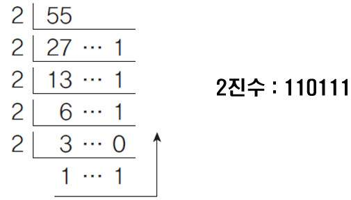

# 문제 43 : 10진수를 2진수로

### 문제 43 : 10진수를 2진수로

우리가 흔히 사용하는 숫자 1, 8, 19, 28893 등등...은 10진수 체계입니다. 이를 컴퓨터가 알아 들을 수 있는 2진수로 바꾸려고 합니다. 어떻게 표현해야 할까요? 예를들어 13은 2^3 + 2^2 + 2^0 = 13 이기 때문에 1101으로 표현합니다. 

**사용자에게 숫자를 입력받고 이를 2진수를 바꾸고 그 값을 출력해주세요.**

\*\*\*\*

### 문제 답안

#### **1\) 2진수**



2진수는 사용자에게 10진수로 입력 받은 값\(**55**\)을 **2로 더 이상 나눌 수 없을 때 까지 계속 나누어서 몫과 나머지 값의 결과 반환**해주는 것을 의미한다. 

#### 2\) 내가 풀은 답안

나는 이 문제를 `Number`객체의 내장 함수 `toString()`를 사용하여 풀었다. 


```javascript
let dec = prompt();
console.log(parseInt(dec).toString(2));
```


#### 3\) 다른 답안

하지만 다른 답안을 보니까 내가 조금 더 생각하지 않고 너무나 간단하게 풀려고 했다는 생각이 들었다. 앞으로 문제를 풀 때에는 그 원리에 대해서 잘 이해하고 어떠한 의도에서 저 문제를 만들었는지 생각하고 풀어야겠다.


```javascript
let dec = prompt();
let arrBinary = []; // 2진수를 저장할 배열

while (dec) {
  arrBinary.push(dec % 2);
  dec = Math.floor(dec / 2);
}

console.log(arrBinary.reverse().join(''));
```


#### Reference

Math.floor\(\)[→\(MDN\)](https://developer.mozilla.org/ko/docs/Web/JavaScript/Reference/Global_Objects/Math/floor)

Array.prototype.reverse\(\)[→\(MDN\)](https://developer.mozilla.org/ko/docs/Web/JavaScript/Reference/Global_Objects/Array/reverse)

