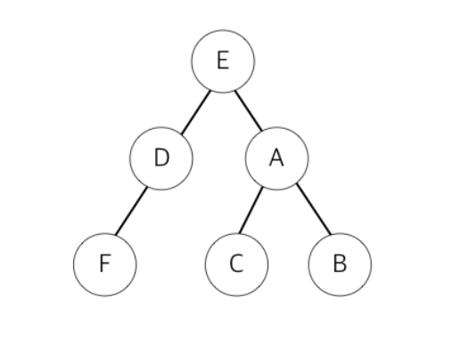

# 문제 72 : 너비 우선 탐색

### 문제 72 : 너비 우선 탐색

**너비우선 탐색이**란 어떤 노드를 방문하여 확인한 후, 목표한 노드가 아니면 그 노드와 연결된 정점들 중에 우선순위가 동일한 다른 노드를 찾고 그 순위에 없으면 그다음 순위 노드를 차례대로 찾는 방법이다.



다음과 같이 리스트 형태로 노드들의 연결 관계가 주어진다고 할 때 **너비 우선 탐색을 한 순서대로 노드의 인덱스를 공백으로 구분하여 출력하세요.**

```javascript
// 데이터
// graph = { 'E': ['D', 'A'],
//           'F': ['D'], 
//           'A': ['E', 'C', 'B'],
//           'B': ['A']
//           'C': ['A']
//           'D': ['E','F']}
// 출력          
// E D A F C B          
```


### 문제 답안


```javascript

```

#### Reference

[→\(MDN\)](https://developer.mozilla.org/ko/docs/Web/JavaScript/Reference/Global_Objects/Date/Date)

